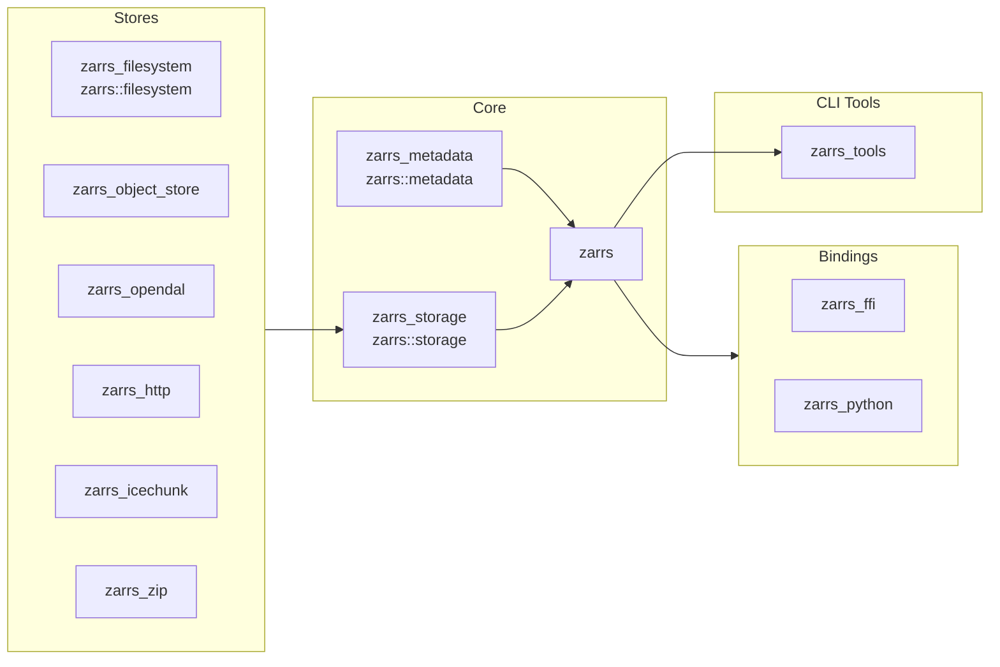

# Crates

## Core Crates

[zarrs_repo]: https://img.shields.io/badge/LDeakin/zarrs-GitHub-blue?logo=github

### `zarrs` [![zarrs_ver]](https://crates.io/crates/zarrs) [![zarrs_doc]](https://docs.rs/zarrs) [![zarrs_repo]](https://github.com/LDeakin/zarrs)
[zarrs_ver]: https://img.shields.io/crates/v/zarrs?label=
[zarrs_doc]: https://docs.rs/zarrs/badge.svg

The core library for manipulating Zarr hierarchies.

### `zarrs_metadata` [![zarrs_metadata_ver]](https://crates.io/crates/zarrs_metadata) [![zarrs_metadata_doc]](https://docs.rs/zarrs_metadata) [![zarrs_repo]](https://github.com/LDeakin/zarrs)
[zarrs_metadata_ver]: https://img.shields.io/crates/v/zarrs_metadata?label=
[zarrs_metadata_doc]: https://docs.rs/zarrs_metadata/badge.svg

Provides Zarr V2 and V3 metadata serialisation and deserialisation.

If you are just interested in manipulating `Zarr` metadata, this crate may be useful to you.

> [!NOTE]
> This crate is re-exported in `zarrs` as `zarrs::metadata`.

### `zarrs_storage` [![zarrs_storage_ver]](https://crates.io/crates/zarrs_storage) [![zarrs_storage_doc]](https://docs.rs/zarrs_storage) [![zarrs_repo]](https://github.com/LDeakin/zarrs)
[zarrs_storage_ver]: https://img.shields.io/crates/v/zarrs_storage?label=
[zarrs_storage_doc]: https://docs.rs/zarrs_storage/badge.svg

The storage API for `zarrs`.

Custom store implementations only need to depend on `zarrs_storage`.

> [!NOTE]
> This crate is re-exported in `zarrs` as `zarrs::storage`.

## Store Crates

### `zarrs_filesystem` [![zarrs_filesystem_ver]](https://crates.io/crates/zarrs_filesystem) [![zarrs_filesystem_doc]](https://docs.rs/zarrs_filesystem) [![zarrs_repo]](https://github.com/LDeakin/zarrs)
[zarrs_filesystem_ver]: https://img.shields.io/crates/v/zarrs_filesystem?label=
[zarrs_filesystem_doc]: https://docs.rs/zarrs_filesystem/badge.svg

A filesystem store for the zarrs crate.

> [!NOTE]
> This crate is re-exported in `zarrs` as `zarrs::filesystem` if the `filesystem` feature is enabled.

### `zarrs_object_store` [![zarrs_object_store_ver]](https://crates.io/crates/zarrs_object_store) [![zarrs_object_store_doc]](https://docs.rs/zarrs_object_store) [![zarrs_repo]](https://github.com/LDeakin/zarrs)
[zarrs_object_store_ver]: https://img.shields.io/crates/v/zarrs_object_store?label=
[zarrs_object_store_doc]: https://docs.rs/zarrs_object_store/badge.svg

[`object_store`](https://docs.rs/object_store/latest/object_store/) store support.

### `zarrs_opendal` [![zarrs_opendal_ver]](https://crates.io/crates/zarrs_opendal) [![zarrs_opendal_doc]](https://docs.rs/zarrs_opendal) [![zarrs_repo]](https://github.com/LDeakin/zarrs)
[zarrs_opendal_ver]: https://img.shields.io/crates/v/zarrs_opendal?label=
[zarrs_opendal_doc]: https://docs.rs/zarrs_opendal/badge.svg

[`opendal`](https://docs.rs/opendal/latest/opendal/) store support.

### `zarrs_http` [![zarrs_http_ver]](https://crates.io/crates/zarrs_http) [![zarrs_http_doc]](https://docs.rs/zarrs_http) [![zarrs_repo]](https://github.com/LDeakin/zarrs)
[zarrs_http_ver]: https://img.shields.io/crates/v/zarrs_http?label=
[zarrs_http_doc]: https://docs.rs/zarrs_http/badge.svg

A synchronous http store.

### `zarrs_zip` [![zarrs_zip_ver]](https://crates.io/crates/zarrs_zip) [![zarrs_zip_doc]](https://docs.rs/zarrs_zip) [![zarrs_repo]](https://github.com/LDeakin/zarrs)
[zarrs_zip_ver]: https://img.shields.io/crates/v/zarrs_zip?label=
[zarrs_zip_doc]: https://docs.rs/zarrs_zip/badge.svg

A storage adapter for zip files.

### `zarrs_icechunk` [![zarrs_icechunk_ver]](https://crates.io/crates/zarrs_icechunk) [![zarrs_icechunk_doc]](https://docs.rs/zarrs_icechunk) [![zarrs_icechunk_repo]](https://github.com/LDeakin/zarrs_icechunk)
[zarrs_icechunk_ver]: https://img.shields.io/crates/v/zarrs_icechunk?label=
[zarrs_icechunk_doc]: https://docs.rs/zarrs_icechunk/badge.svg
[zarrs_icechunk_repo]: https://img.shields.io/badge/LDeakin/zarrs_icechunk-GitHub-blue?logo=github

[`icechunk`](https://docs.rs/icechunk/latest/icechunk/) store support.

## Bindings

### `zarrs_ffi` [![zarrs_ffi_ver]](https://crates.io/crates/zarrs_ffi) [![zarrs_ffi_doc]](https://docs.rs/zarrs_ffi) [![zarrs_ffi_repo]](https://github.com/LDeakin/zarrs_ffi)
[zarrs_ffi_ver]: https://img.shields.io/crates/v/zarrs_ffi?label=
[zarrs_ffi_doc]: https://docs.rs/zarrs_ffi/badge.svg
[zarrs_ffi_repo]: https://img.shields.io/badge/LDeakin/zarrs_ffi-GitHub-blue?logo=github

A subset of `zarrs` exposed as a C/C++ API.

This crate is detailed in the [C/C++ Bindings](./zarrs_ffi.md) chapter.

### `zarrs_python` [![zarrs_python_ver]](https://crates.io/crates/zarrs_python) [![zarrs_python_doc]](https://docs.rs/zarrs_python) [![zarrs_python_repo]](https://github.com/ilan-gold/zarrs-python)
[zarrs_python_ver]: https://img.shields.io/crates/v/zarrs_python?label=
[zarrs_python_doc]: https://docs.rs/zarrs_python/badge.svg
[zarrs_python_repo]: https://img.shields.io/badge/ilan-gold/zarrs_python-GitHub-blue?logo=github

A `CodecPipeline` for the `zarr` Python reference implementation that uses `zarrs`.

This crate is detailed in the [Python Bindings](./zarrs_python.md) chapter.

## CLI Tools

### `zarrs_tools` [![zarrs_tools_ver]](https://crates.io/crates/zarrs_tools) [![zarrs_tools_doc]](https://docs.rs/zarrs_tools) [![zarrs_tools_repo]](https://github.com/LDeakin/zarrs_tools)
[zarrs_tools_ver]: https://img.shields.io/crates/v/zarrs_tools?label=
[zarrs_tools_doc]: https://docs.rs/zarrs_tools/badge.svg
[zarrs_tools_repo]: https://img.shields.io/badge/LDeakin/zarrs_tools-GitHub-blue?logo=github

Various tools for creating and manipulating Zarr v3 data with the `zarrs` rust crate.
