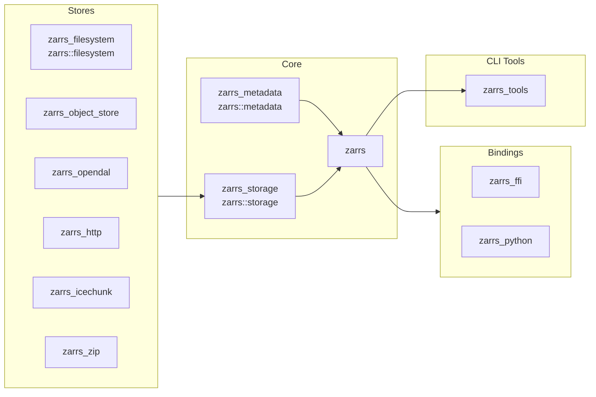

# Crates

## Core Crates

### `zarrs` [![zarrs_ver]](https://crates.io/crates/zarrs) [![docs]](https://docs.rs/zarrs)
[zarrs_ver]: https://img.shields.io/crates/v/zarrs?label=

The core library for manipulating Zarr hierarchies.

### `zarrs_metadata` [![zarrs_metadata_ver]](https://crates.io/crates/zarrs_metadata) [![docs]](https://docs.rs/zarrs_metadata)
[zarrs_metadata_ver]: https://img.shields.io/crates/v/zarrs_metadata?label=

Provides Zarr V2 and V3 metadata serialisation and deserialisation.
If you are just interested in manipulating `Zarr` metadata, this crate may be useful to you.

Typically you would not use this crate directly, it is re-exported as `zarrs::metadata`.

### `zarrs_storage` [![zarrs_storage_ver]](https://crates.io/crates/zarrs_storage) [![docs]](https://docs.rs/zarrs_storage)
[zarrs_storage_ver]: https://img.shields.io/crates/v/zarrs_storage?label=

The storage API for `zarrs`. Custom store implementations only need to depend on `zarrs_storage`.

Typically you would not use this crate directly, it is re-exported as `zarrs::storage`.

[docs]: https://img.shields.io/badge/docs-brightgreen

## Store Crates

### `zarrs_filesystem` [![zarrs_filesystem_ver]](https://crates.io/crates/zarrs_filesystem) [![zarrs_filesystem_doc]](https://docs.rs/zarrs_filesystem)

[zarrs_filesystem_ver]: https://img.shields.io/crates/v/zarrs_filesystem?label=
[zarrs_filesystem_doc]: https://docs.rs/zarrs_filesystem/badge.svg

### `zarrs_object_store` [![zarrs_object_store_ver]](https://crates.io/crates/zarrs_object_store) [![zarrs_object_store_doc]](https://docs.rs/zarrs_object_store)

[`object_store`](https://docs.rs/object_store/latest/object_store/) store support.

[zarrs_object_store_ver]: https://img.shields.io/crates/v/zarrs_object_store?label=
[zarrs_object_store_doc]: https://docs.rs/zarrs_object_store/badge.svg

### `zarrs_opendal` [![zarrs_opendal_ver]](https://crates.io/crates/zarrs_opendal) [![zarrs_opendal_doc]](https://docs.rs/zarrs_opendal)

[`opendal`](https://docs.rs/opendal/latest/opendal/) store support

[zarrs_opendal_ver]: https://img.shields.io/crates/v/zarrs_opendal?label=
[zarrs_opendal_doc]: https://docs.rs/zarrs_opendal/badge.svg

### `zarrs_http` [![zarrs_http_ver]](https://crates.io/crates/zarrs_http) [![zarrs_http_doc]](https://docs.rs/zarrs_http)

A synchronous http store.

[zarrs_http_ver]: https://img.shields.io/crates/v/zarrs_http?label=
[zarrs_http_doc]: https://docs.rs/zarrs_http/badge.svg

### `zarrs_zip` [![zarrs_zip_ver]](https://crates.io/crates/zarrs_zip) [![zarrs_zip_doc]](https://docs.rs/zarrs_zip)

A storage adapter for zip files.

[zarrs_zip_ver]: https://img.shields.io/crates/v/zarrs_zip?label=
[zarrs_zip_doc]: https://docs.rs/zarrs_zip/badge.svg

### `zarrs_icechunk` [![zarrs_icechunk_ver]](https://crates.io/crates/zarrs_icechunk) [![zarrs_icechunk_doc]](https://docs.rs/zarrs_icechunk)
[`icechunk`](https://docs.rs/icechunk/latest/icechunk/) store support.

[zarrs_icechunk_ver]: https://img.shields.io/crates/v/zarrs_icechunk?label=
[zarrs_icechunk_doc]: https://docs.rs/zarrs_icechunk/badge.svg
