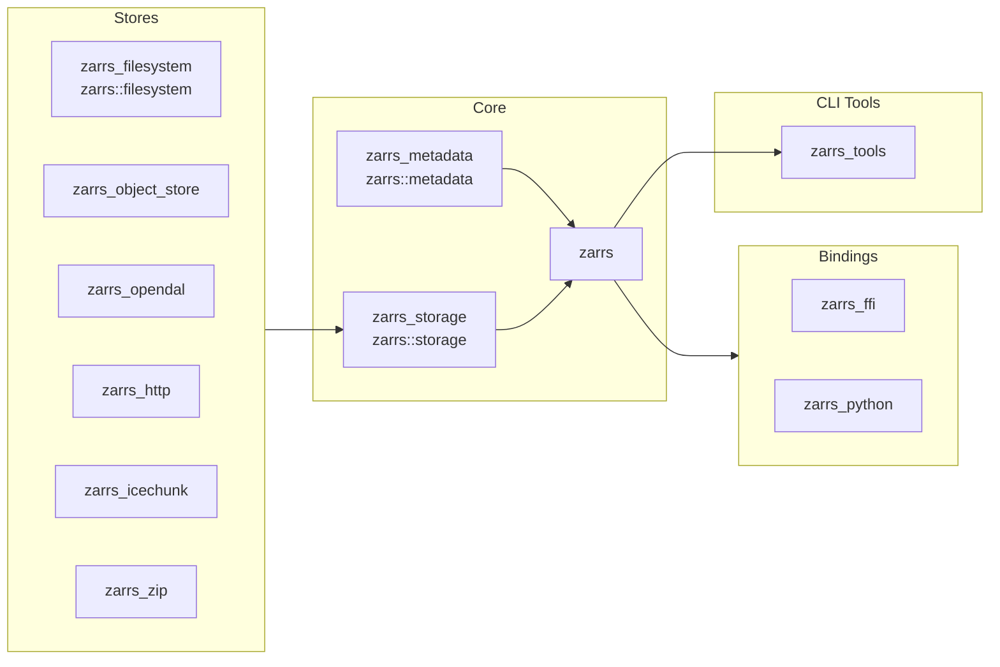

# Installation

## Prerequisites

The most recent `zarrs` requires [Rust](https://www.rust-lang.org/) version  or newer.

You can check your current Rust version by running:
```sh
rustc --version
```
If you don’t have Rust installed, follow the [official Rust installation guide](https://www.rust-lang.org/tools/install).

Some optional `zarrs` codecs require:
- The [CMake](https://cmake.org/) build system.
- The [Clang](https://clang.llvm.org/get_started.html) compiler.

These are typically available through package managers on Linux, Homebrew on Mac, etc.

## Adding `zarrs` to Your Rust Library/Application

`zarrs` is a Rust library.
To use it as a dependency in your Rust project, add it to your `Cargo.toml` file:

```toml
[dependencies]
zarrs = "18.0" # Replace with the latest version
```

The latest version is [](https://crates.io/crates/zarrs).
See [crates.io](https://crates.io/crates/zarrs/versions) for a full list of versions.

To use the latest development release:
```toml
[dependencies]
zarrs = { git = "https://github.com/LDeakin/zarrs.git" }
```

The [Cargo reference](https://doc.rust-lang.org/cargo/reference/specifying-dependencies.html#specifying-dependencies-from-git-repositories) has more information on `git` repository dependencies.


## Crate Features

`zarrs` has a number of features for stores, codecs, or APIs, many of which are enabled by default.
The below example demonstrates how to disable default features and explicitly enable required features:

```toml
[dependencies.zarrs]
version = "18.0"
default-features = false
features = ["filesystem", "blosc"]
```

See [zarrs (docs.rs) - Crate Features](https://docs.rs/zarrs/latest/zarrs/index.html#crate-features) for an up-to-date list of all available features.

## `zarrs` Crates
Some `zarrs` functionality (e.g. additional stores, bindings, etc.) are in separate crates.



### Core Crates

#### `zarrs` [![zarrs_ver]](https://crates.io/crates/zarrs) [![zarrs_doc]](https://docs.rs/zarrs) [![zarrs_repo]](https://github.com/LDeakin/zarrs)
[zarrs_ver]: https://img.shields.io/crates/v/zarrs
[zarrs_doc]: https://docs.rs/zarrs/badge.svg
[zarrs_repo]: https://img.shields.io/badge/LDeakin/zarrs/zarrs-GitHub-blue?logo=github

The core library for manipulating Zarr hierarchies.

#### `zarrs_metadata` [![zarrs_metadata_ver]](https://crates.io/crates/zarrs_metadata) [![zarrs_metadata_doc]](https://docs.rs/zarrs_metadata) [![zarrs_metadata_repo]](https://github.com/LDeakin/zarrs/tree/main/zarrs_metadata)
[zarrs_metadata_ver]: https://img.shields.io/crates/v/zarrs_metadata
[zarrs_metadata_doc]: https://docs.rs/zarrs_metadata/badge.svg
[zarrs_metadata_repo]: https://img.shields.io/badge/LDeakin/zarrs/zarrs__metadata-GitHub-blue?logo=github

Provides Zarr V2 and V3 metadata serialisation and deserialisation.

If you are just interested in manipulating `Zarr` metadata, this crate may be relevant.

> [!NOTE]
> This crate is re-exported in `zarrs` as `zarrs::metadata`.

#### `zarrs_storage` [![zarrs_storage_ver]](https://crates.io/crates/zarrs_storage) [![zarrs_storage_doc]](https://docs.rs/zarrs_storage) [![zarrs_storage_repo]](https://github.com/LDeakin/zarrs/tree/main/zarrs_storage)
[zarrs_storage_ver]: https://img.shields.io/crates/v/zarrs_storage
[zarrs_storage_doc]: https://docs.rs/zarrs_storage/badge.svg
[zarrs_storage_repo]: https://img.shields.io/badge/LDeakin/zarrs/zarrs__storage-GitHub-blue?logo=github

The storage API for `zarrs`.

Custom store implementations only need to depend on `zarrs_storage`.

> [!NOTE]
> This crate is re-exported in `zarrs` as `zarrs::storage`.

### Store Crates

The [Stores](./stores.md) chapter details the various types of stores and their associated crates.

### Bindings

#### `zarrs_ffi` [![zarrs_ffi_ver]](https://crates.io/crates/zarrs_ffi) [![zarrs_ffi_doc]](https://docs.rs/zarrs_ffi) [![zarrs_ffi_repo]](https://github.com/LDeakin/zarrs_ffi)
[zarrs_ffi_ver]: https://img.shields.io/crates/v/zarrs_ffi
[zarrs_ffi_doc]: https://docs.rs/zarrs_ffi/badge.svg
[zarrs_ffi_repo]: https://img.shields.io/badge/LDeakin/zarrs__ffi-GitHub-blue?logo=github

A subset of `zarrs` exposed as a C/C++ API.

This crate is detailed in the [C/C++ Bindings](./zarrs_ffi.md) chapter.

#### `zarrs-python` [![zarrs_python_ver]](https://pypi.org/project/zarrs/) [![zarrs_python_doc]](https://zarrs-python.readthedocs.io/en/latest/) [![zarrs_python_repo]](https://github.com/ilan-gold/zarrs-python)
[zarrs_python_ver]: https://img.shields.io/pypi/v/zarrs
[zarrs_python_doc]: https://img.shields.io/readthedocs/zarrs-python
[zarrs_python_repo]: https://img.shields.io/badge/ilan--gold/zarrs--python-GitHub-blue?logo=github

A `CodecPipeline` for the `zarr` Python reference implementation that uses `zarrs`.

This crate is detailed in the [Python Bindings](./zarrs_python.md) chapter.

### CLI Tools

#### `zarrs_tools` [![zarrs_tools_ver]](https://crates.io/crates/zarrs_tools) [![zarrs_tools_doc]](https://docs.rs/zarrs_tools) [![zarrs_tools_repo]](https://github.com/LDeakin/zarrs_tools)
[zarrs_tools_ver]: https://img.shields.io/crates/v/zarrs_tools
[zarrs_tools_doc]: https://docs.rs/zarrs_tools/badge.svg
[zarrs_tools_repo]: https://img.shields.io/badge/LDeakin/zarrs__tools-GitHub-blue?logo=github

Various tools for creating and manipulating Zarr v3 data with the `zarrs` rust crate.

This crate is detailed in the [zarrs_tools](./zarrs_tools.md) chapter.
